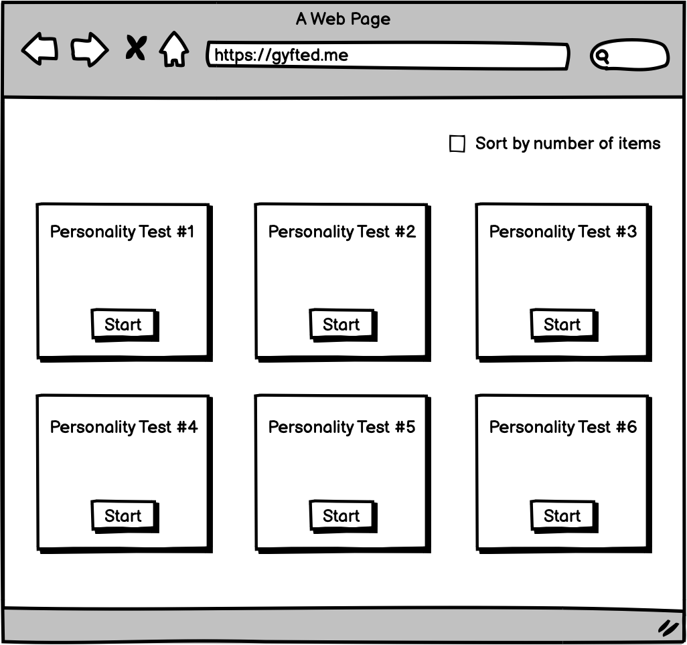
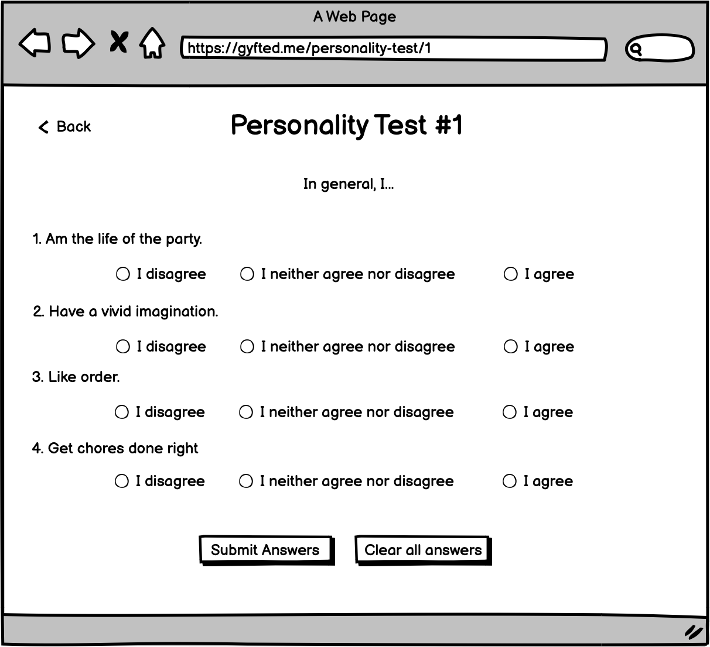
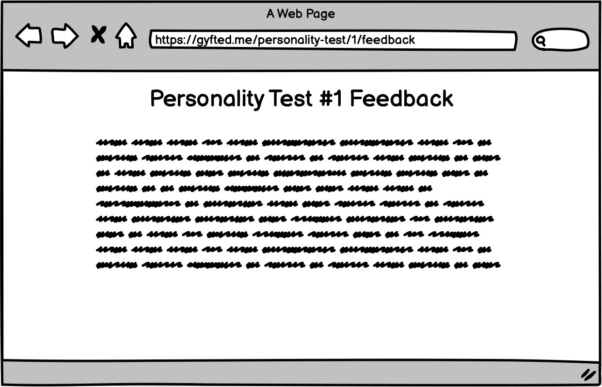

# Front-End Developer Recruitment Task

Thank you for taking time to solve this assignment! We're excited to see what you will build and hope you'll have some fun along the way!

## Introduction
Your task is to implement a React app where users can solve personality tests and get feedback on their answers.

We don't expect you to spend more than `2 hours` on this assignment. We expect the basic functionality to be there within
this time frame.

If you'd like to challenge yourself and spend more time to polish the app go for it!
We'll be happy to evaluate and give feedback on the whole project once you're done.

## Setup and submission

Please create a private Github repository and add us as collaborators (work@humanexponent.com) once you're ready to share.
If you encounter any issues with the submission please email us.

## Screens

### Home Page

* List of personality tests to solve.
* On `Start` click redirect to `Personality Test` page.
* You can assume that each test has the same name, questions and possible answers,
 but differs only by an id (e.g. `Personality Test #1` vs `Personality Test #2`).

### Personality Test Page

* This page contains a list of questions and possible answers to a personality test.
* It includes the title of a personality test at the top.
* Assume that it's possible to select only one answer under each question.
* Assume that the set of possible answers to any questions is the same (agree / neither agree nor disagree / disagree).
* Click on `Back` button should take you to `Home Page`.
* Click on `Submit Answers` button should redirect you to `Personality Feedback Page`.

### Personality Feedback Page

* This page contains feedback on answers to a particular personality test.
* It includes the title of the feedback for a particular personality test at the top.
* It includes text with feedback based on the answers to a particular personality test.
* Assume you can hardcode the text of the feedback but in the back-end it should vary
  depending on the personality test chosen and answers given by a user.

## Must have

1. Use React & Redux.
2. Create a `create-react-app` so we can run your code!
3. Use of react-router for multiple pages.

## Good to have

1. Clean code (linters, prettier)
2. UI kit for styles (or styled-components)
3. Tests
4. Exception handling
5. Usage of modern js functionality (ES6+)
6. Deployed app

## What will we be paying attention to:
* Can we run your code?
* Can we understand your code?
* How you architected your app, e.g. how you split the code into components.
* If / how did you make your components reusable.
* How and where you put your business logic.

## What we'll be paying less attention to:
* For this assignment we're less interested in how pretty the app looks like, but rather how functional and reliable it is.

