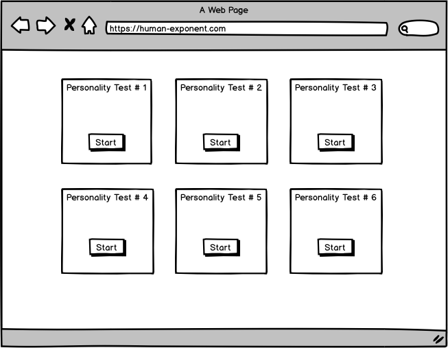
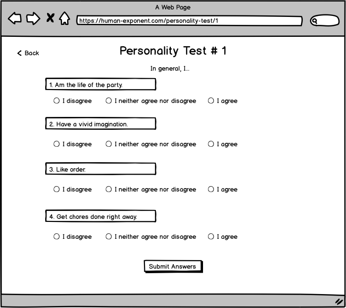
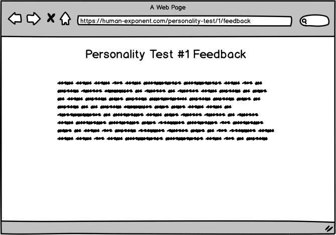

# Frontend Internship Recruitment Task

Thank you for taking the time to solve this assignment! We're excited to see what you will build and hope you'll have some fun along the way!

If you didn't have a chance before, have a look at our [website](https://gyfted.me/) to get a deeper understanding of what we're building at Gyfted.

## Introduction
Your task is to implement a some part of a simple MERN stack app where users can solve personality tests and get feedback on their answers.

We don't expect you to spend more than `2 hour` on this assignment.

If you'd like to challenge yourself and spend more time to polish the app go for it!
We'll be happy to evaluate and give feedback on the whole project once you're done.

### Github setup

Please create a private Github repository and add us as collaborators (work@humanexponent.com) once you're ready to share.
If you encounter any issues with the submission please email us (work@humanexponent.com or adam@humanexponent.com)

### App setup

* Clone current repository and use it as the starter.
* Run `npm install` in **main folder** and **client folder** to install dependencies.
* Run `npm run dev` to run the app locally.

## Screens

### Home Page (already implemented)

* List of personality tests to solve.
* On `Start` click redirect to specific `Personality Test` page.
* Each test has a set of questions. For each question there is a set of possible answers.

### Personality Test Page (Front End to be implemented)

* This page contains a list of questions and possible answers to a personality test.
* It includes the title of a personality test at the top.
* Assume that it's possible to select only one answer under each question.
* The set of possible answers to questions might be different.
* Click on `Back` button should take you to `Home Page`.
* Click on `Submit Answers` button should send results to Backend and redirect you to `Personality Feedback Page`.

### Personality Feedback Page (Front End and small Backend to be implemented)

* This page contains feedback on answers to a particular personality test.
* It includes the title of the feedback for a particular personality test at the top.
* It includes text with feedback to a particular personality test given user's result.
* Use the feedbacks provided in `mockData.js` for each test.

## Task

### Psychometric test [First part]

You are about to build a simple psychometric quiz.
A quiz consists of multiple questions and each question has a set of possible answers.

Your task is to build a view (similar to the presented above, in `Personality Test Page`) where user can pick an answer for each question in a quiz. 
We've already implemented a code, which makes a request to backend and returns required questions and related answers.

Use the quiz data and display it in front end (inside `Test` component).

### Feedback page [Second part]

After user completes the test, we want you to display an example feedback (available in `mockedData.js`).

Each quiz has 2 possible feedbacks. We want users to be happy, so we want to display feedback with minScore that is possibly the greatest. 

As an example: if there are 2 feedbacks for one quiz, first with minScore: 0, and second with minScore: 5, and added value of user's answers for that quiz is greater than or equal to 5 we want to display second feedback (minScore: 5) otherwise display first (with minScore: 0).

For this task you should implement both frontend and backend.

## Good to have

1. Clean code (linters, prettier)
2. UI kit for styles (or styled-components)
3. Usage of modern js functionality (ES6+)
4. Deployed app

## What will we be paying attention to:
* Can we run your code?
* Can we understand your code?
* How you architected your app, e.g. how you split the code into components.
* If / how did you make your components reusable.

## What we'll be paying less attention to:
* For this assignment we're less interested in how pretty the app looks like, but rather how functional and reliable it is.
